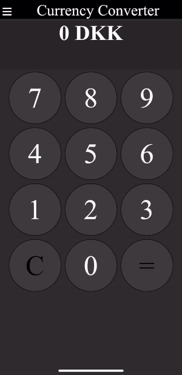

# Currency Converter Mobile App

T
It is a currency converter which uses AJAX to retrieve the rates from the ECB XML feed.
These rates are then stored in storage and then the Javascript takes over in calculating the conversions.
There is also a hamburger menu within this which allows you to change the currencies you are converting and add a bank fee if you wish.
It will then store all these values in local storage so it can stick to these values even if you exit and reopen the app.
The app also includes a manifest file allowing the app to work offline.

